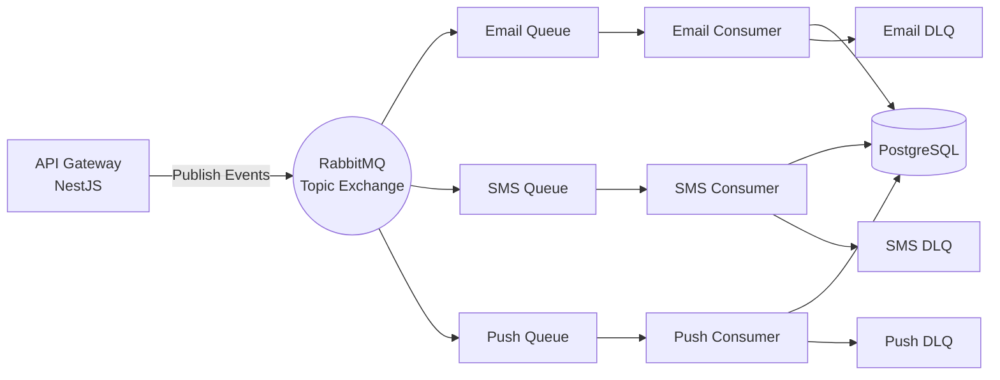

# 📣 Distributed Notification System (NestJS + RabbitMQ)

## Overview
This project is a **production-style distributed notification system** built with **NestJS and RabbitMQ**.  
It demonstrates how modern backend systems handle **asynchronous communication**, **event-driven architecture**, and **reliable message delivery** for Email, SMS, and Push notifications.

The system is intentionally **medium-sized** — not a toy project, not an enterprise monolith — making it ideal for showcasing **real-world RabbitMQ skills** on a resume or in interviews.

---

## 🎯 Purpose of the Project
- Showcase **RabbitMQ messaging patterns** used in real production systems
- Demonstrate **event-driven microservice architecture**
- Implement **reliable notification delivery** with retries and Dead Letter Queues (DLQ)
- Separate responsibilities using **publisher–consumer design**
- Gain hands-on experience with **NestJS, message queues, Docker, and Prisma**

---

## 🏆 Key Achievements
✔ Event-driven communication using RabbitMQ Topic Exchanges  
✔ Asynchronous Email / SMS / Push notification processing  
✔ Retry mechanism with Dead Letter Queues (DLQ)  
✔ Message acknowledgment & failure handling  
✔ Email templating with Handlebars  
🚧 Persistent notification logs using PostgreSQL + Prisma  
✔ Dockerized local development environment  
✔ Clean, extensible backend architecture  

---

## 🧰 Technology Stack

### Backend
- **NestJS / Node.js**
- **RabbitMQ (AMQP)**
- **PostgreSQL**
- *Prisma ORM*
- **Nodemailer** (Email)
- **Handlebars** (Email templates)

### Infrastructure / Tooling
- **Docker & Docker Compose**
- **RabbitMQ Management UI**
- **Postman** (API testing)

---

## 🏗️ High-Level Architecture



---

## 🔄 How the System Works

### 1️⃣ API Gateway (Publisher)
The API Gateway exposes REST endpoints such as:
- `/signup`
- `/order`
- `/notify`

When an API request is received:
1. Input is validated
2. An **event message** is created
3. The message is published to RabbitMQ using a **topic exchange**
4. The API responds immediately (non-blocking)

➡️ The API **never sends notifications directly**

---

### 2️⃣ RabbitMQ (Message Broker)
- Uses a **Topic Exchange**: `notifications.topic`
- Routes messages using routing keys such as:
  - `user.signup.email`
  - `order.completed.email`
  - `notify.sms`

RabbitMQ ensures:
- Message durability
- Loose coupling between services
- Horizontal scalability

---

### 3️⃣ Notification Service (Consumers)
The Notification Service listens to queues:
- `queue.email`
- `queue.sms`
- `queue.push`

For each message:
1. Message is consumed
2. Business logic is executed (send email/SMS/etc.)
3. Result is logged to database
4. Message is acknowledged (`ACK`) on success

---

### 4️⃣ Retry & Dead Letter Queue (DLQ) Logic
If message processing fails:
- The message is retried up to **3 times**
- Retry count is tracked via headers
- After max retries → message is sent to **DLQ**

This prevents:
- Infinite retry loops
- Queue blocking
- Silent message loss

---

### 5️⃣ Email Templating
- Emails are rendered using **Handlebars**
- Templates are reusable and data-driven
- Allows clean separation of content and logic

Example:
```hbs
<h1>Welcome {{name}}</h1>
<p>Thanks for joining our platform.</p>
```

---

### 6️⃣ Notification Logging
Each notification attempt is persisted with:
- Event type
- Channel (email/sms/push)
- Status (success / failed)
- Retry count
- Payload snapshot
- Timestamp

This enables:
- Auditing
- Debugging
- Metrics & analytics

---

## 🧪 Local Development

### Start Services
```bash
docker-compose up -d
```

### RabbitMQ UI
```
http://localhost:15672
username: guest
password: guest
```

### Test APIs
- Import the provided Postman collection
- Or run:
```bash
bash curl_examples.sh
```

---

## 🚀 Why This Project Is Resume-Worthy
- Uses **real backend patterns**, not tutorials
- Demonstrates **production RabbitMQ concepts**
- Shows **system design thinking**
- Easily extensible to Kafka or cloud messaging
- Clear separation of concerns and scalability

---

## 🔮 Future Improvements
- Kafka implementation for comparison
- Prometheus + Grafana monitoring
- Rate limiting & deduplication
- Webhook notifications
- Admin dashboard for logs

---

## 👨‍💻 Author
Built as a backend-focused project to demonstrate **event-driven systems, messaging reliability, and scalable notification architecture**.
